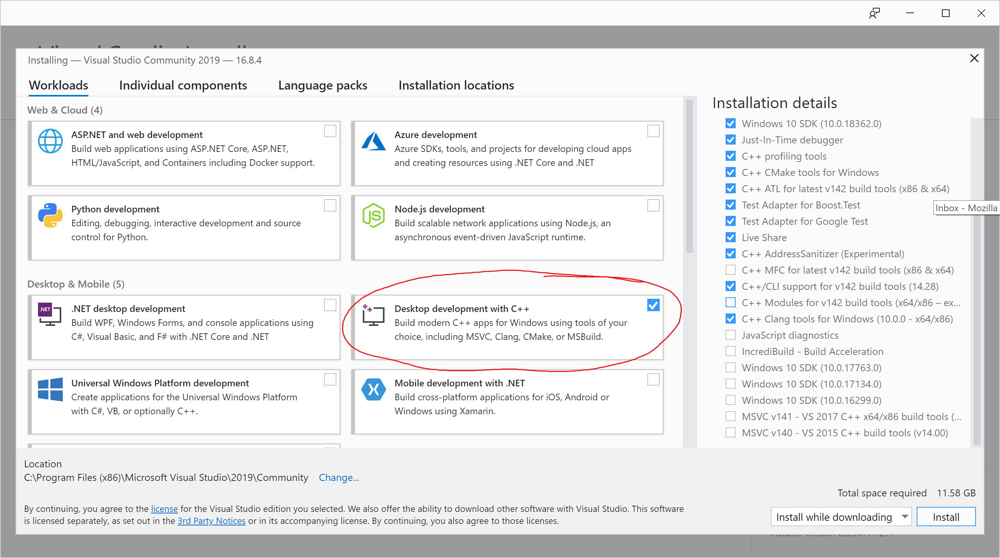

# cplusplus-beginners

This is a fork of the [Udemy beginner C++ course by John Purcell](https://www.udemy.com/course/free-learn-c-tutorial-beginners/).
This course covers most of the C++ programming concepts that will be used in CS312 (with the exception of the templates and the 
standard template library). We will review C++ in the first few weeks of class.   

# How to build

The Udemy course covers how to build using Eclipse. You're welcome to use any development environment you like. However, if you don't have 
a C++ development environment that you're already happy with, I will recommend the following for class.

## Windows

We will use Microsoft's Visual Studio as our IDE (integrated development environment). Visual studio combines an editor and 
visual debugger. 

1. Install [Visual Studio Community 2019](https://visualstudio.microsoft.com/vs/community/), our C++ compiler

*Important!!* During installation, select: Desktop development with C++ 

2. Double click the solution file to open it: `2019MSDev/cplusplus.sln`. 

Quick tips for using visual studio:

* From the menu, click "Build/Build Solution" to build every example. 
* Right click an example from the pane at the right (in the "Solution Explorer") to make it the current project. 
* To run from the menu, click "Debug/Start Debugging" to step through the code line by line.

For those of you new to Visual Studio, this video shows how to build, run, and debug. 

## macOS 

On macOS, I recommend Visual Studio Code (VS Code) with clang as our C++ compiler and lldb as our C++ debugger. 

1. Install Clang, our C++ compiler. 

From terminal, run `command xcode-select --install`

* You can follow the instructions [here](https://www.ics.uci.edu/~pattis/common/handouts/macclion/clang.html)
* A quick way to open terminal is to use spotlight. From the keyboard, type the `<cmd>` and `<spacebar>`. Then type `terminal` at the popup edit field.

2. Install [VS Code](https://code.visualstudio.com/)

VS Code combines a terminal, editor window, and visual debugger together. 

Quick tips for using VS Code with its terminal: 

* To build, you run the command `clang++ <filename>` in the terminal. This will generate an executable, called `a.out`
* To run, type `.\a.out` in the VS Code terminal.

